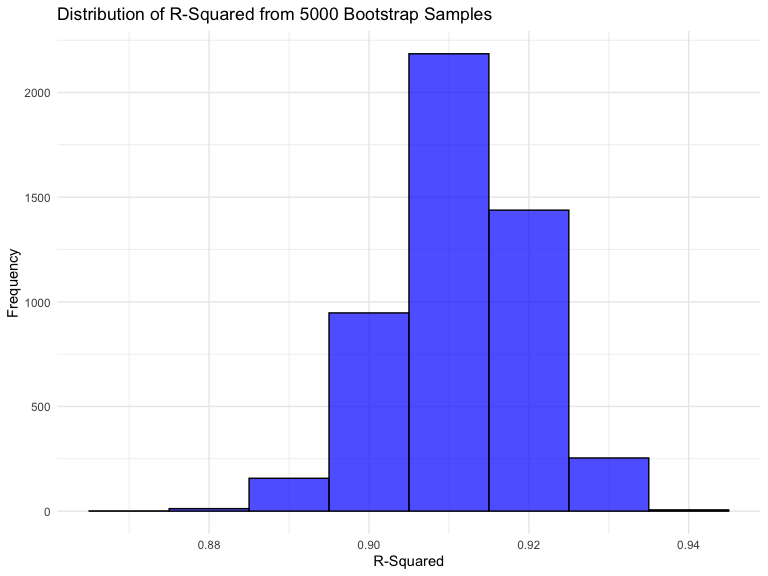

p8105_hw6_coo2124
================
Christiana Odewumi
2024-12-01

# Load libraries

``` r
library(rnoaa)
```

    ## The rnoaa package will soon be retired and archived because the underlying APIs have changed dramatically. The package currently works but does not pull the most recent data in all cases. A noaaWeather package is planned as a replacement but the functions will not be interchangeable.

``` r
library(tidyverse)
```

    ## ── Attaching core tidyverse packages ──────────────────────── tidyverse 2.0.0 ──
    ## ✔ dplyr     1.1.4     ✔ readr     2.1.5
    ## ✔ forcats   1.0.0     ✔ stringr   1.5.1
    ## ✔ ggplot2   3.5.1     ✔ tibble    3.2.1
    ## ✔ lubridate 1.9.3     ✔ tidyr     1.3.1
    ## ✔ purrr     1.0.2

    ## ── Conflicts ────────────────────────────────────────── tidyverse_conflicts() ──
    ## ✖ dplyr::filter() masks stats::filter()
    ## ✖ dplyr::lag()    masks stats::lag()
    ## ℹ Use the conflicted package (<http://conflicted.r-lib.org/>) to force all conflicts to become errors

``` r
library(broom)
library(ggplot2)
library(modelr)
```

    ## 
    ## Attaching package: 'modelr'
    ## 
    ## The following object is masked from 'package:broom':
    ## 
    ##     bootstrap

``` r
library(mgcv)
```

    ## Loading required package: nlme
    ## 
    ## Attaching package: 'nlme'
    ## 
    ## The following object is masked from 'package:dplyr':
    ## 
    ##     collapse
    ## 
    ## This is mgcv 1.9-1. For overview type 'help("mgcv-package")'.

``` r
library(purrr)

set.seed(1)


knitr::opts_chunk$set(
    echo = TRUE,
    warning = FALSE,
    fig.width = 8, 
  fig.height = 6,
  out.width = "90%"
)

theme_set(theme_minimal() + theme(legend.position = "bottom"))

options(
  ggplot2.continuous.colour = "viridis",
  ggplot2.continuous.fill = "viridis"
)

scale_colour_discrete = scale_colour_viridis_d
scale_fill_discrete = scale_fill_viridis_d
```

### Problem 1

Download and prepare the 2017 Central Park weather data

``` r
weather_df = 
  rnoaa::meteo_pull_monitors(
    c("USW00094728"),
    var = c("PRCP", "TMIN", "TMAX"), 
    date_min = "2017-01-01",
    date_max = "2017-12-31") %>%
  mutate(
    name = recode(id, USW00094728 = "CentralPark_NY"),
    tmin = tmin / 10,
    tmax = tmax / 10) %>%
  select(name, id, everything())
```

    ## using cached file: /Users/tunmiseodewumi/Library/Caches/org.R-project.R/R/rnoaa/noaa_ghcnd/USW00094728.dly

    ## date created (size, mb): 2024-12-01 11:59:50.361595 (8.667)

    ## file min/max dates: 1869-01-01 / 2024-11-30

``` r
weather_df %>% 
  ggplot(aes(x = tmin, y = tmax)) + 
  geom_point() + 
  labs(
    title = "Relationship Between Daily Minimum and Maximum Temperatures (2017)",
    x = "Minimum Temperature (°C)",
    y = "Maximum Temperature (°C)"
  ) +
  theme_minimal()
```


we are interested in the distribution of two quantities estimated from
these data

``` r
compute_metrics = function(weather_sample) {
  model = lm(tmax ~ tmin, data = weather_sample)
  r_squared = glance(model)$r.squared
  coefficients = tidy(model)
  
  intercept = coefficients |>
    filter(term == "(Intercept)")|>
    pull(estimate)
  
  slope = coefficients|>
    filter(term == "tmin") |> 
    pull(estimate)
  
  log_beta_product = ifelse(intercept * slope > 0, log(intercept * slope), NA)
  
  tibble(
    r_squared = r_squared,
    log_beta_product = log_beta_product
  )
}
```

Use 5000 bootstrap samples and, for each bootstrap sample, produce
estimates of these two quantities.

``` r
bootstrap_results <- 
  weather_df |> 
  modelr::bootstrap(n = 5000) |> 
  mutate(
    models = map(strap,as_tibble),
    results = map(models, compute_metrics),
  ) |> 
  unnest(results)
```

Plot the distribution of your estimates, and describe these in words.

``` r
ggplot(bootstrap_results, aes(x = r_squared)) +
  geom_histogram(binwidth = 0.01, fill = "blue", color = "black", alpha = 0.7) +
  labs(
    title = "Distribution of R-Squared from 5000 Bootstrap Samples",
    x = "R-Squared",
    y = "Frequency"
  ) +
  theme_minimal()
```


The histogram shows the distribution of r-square values from 5000
bootstrap samples, centered around 0.91, indicating the model
consistently explains about 91% of the variability in the data. The
distribution is unimodal with a slight left skew and minimal spread,
suggesting the model’s performance is robust and reliable across
samples. Only a few samples have r-square values below 0.90 or above
0.92, further highlighting the model’s stability.

``` r
ggplot(bootstrap_results, aes(x = log_beta_product)) +
  geom_histogram(binwidth = 0.01, fill = "pink", color = "black", alpha = 0.7) +
  labs(
    title = "Distribution of log(beta0 * beta1) from 5000 Bootstrap Samples",
    x = "log(beta0 * beta1)",
    y = "Frequency"
  ) +
  theme_minimal()
```


The histogram shows the distribution of log(𝛽̂ 0∗𝛽̂ 1) from 5000 bootstrap
samples. The distribution is unimodal and symmetric, centered around
approximately 2.02. The spread is narrow, indicating minimal variability
in the logarithm of the product of the coefficients. This suggests that
the relationship between the intercept and slope in the regression model
is consistent and stable across bootstrap samples.

``` r
summary_results = bootstrap_results |> 
  summarize(
    r_squared_lower = quantile(r_squared, 0.025),
    r_squared_upper = quantile(r_squared, 0.975),
    log_beta_product_lower = quantile(log_beta_product, 0.025),
    log_beta_product_upper = quantile(log_beta_product, 0.975)
  )
summary_results
```

    ## # A tibble: 1 × 4
    ##   r_squared_lower r_squared_upper log_beta_product_lower log_beta_product_upper
    ##             <dbl>           <dbl>                  <dbl>                  <dbl>
    ## 1           0.894           0.927                   1.96                   2.06

The 95% confidence intervals are 0.894–0.927 for r-square and
1.967–2.058 for log(𝛽̂ 0∗𝛽̂) , indicating the model’s reliability and
consistency.

### problem 2

Load the data from GitHub

``` r
homicides <- read_csv("https://raw.githubusercontent.com/washingtonpost/data-homicides/master/homicide-data.csv")
```

    ## Rows: 52179 Columns: 12
    ## ── Column specification ────────────────────────────────────────────────────────
    ## Delimiter: ","
    ## chr (9): uid, victim_last, victim_first, victim_race, victim_age, victim_sex...
    ## dbl (3): reported_date, lat, lon
    ## 
    ## ℹ Use `spec()` to retrieve the full column specification for this data.
    ## ℹ Specify the column types or set `show_col_types = FALSE` to quiet this message.

``` r
cleaned_homicides <- homicides |> 
  mutate(
    city_state = paste(city, state, sep = ", "),
    solved = ifelse(disposition == "Closed by arrest", 1, 0),
    victim_age = as.numeric(victim_age)
  ) |> 
  filter(
    !city_state %in% c("Dallas, TX", "Phoenix, AZ", "Kansas City, MO", "Tulsa, AL"),
    victim_race %in% c("White", "Black")
  )
```

For the city of Baltimore, MD, use the glm function to fit a logistic
regression with resolved vs unresolved as the outcome and victim age,
sex and race as predictors.

``` r
baltimore_data = cleaned_homicides |> 
  filter(city_state == "Baltimore, MD") |>
  select(solved, victim_age, victim_race, victim_sex)

baltimore_model = glm(
  solved ~ victim_age + victim_sex + victim_race,
  data = baltimore_data,
  family = "binomial"
)

save(baltimore_model, file = "./results/baltimore_model.RData")

baltimore_results = baltimore_model |>
  broom::tidy() |> 
  knitr::kable(digits = 3)

baltimore_results
```

| term             | estimate | std.error | statistic | p.value |
|:-----------------|---------:|----------:|----------:|--------:|
| (Intercept)      |    0.310 |     0.171 |     1.810 |   0.070 |
| victim_age       |   -0.007 |     0.003 |    -2.024 |   0.043 |
| victim_sexMale   |   -0.854 |     0.138 |    -6.184 |   0.000 |
| victim_raceWhite |    0.842 |     0.175 |     4.818 |   0.000 |

fit logistic regression for each city and extract the adjusted odds
ratio and confidence intervals for male vs female victims

``` r
baltimore_results = 
  broom::tidy(baltimore_model, conf.int = TRUE) |>
  mutate(
    OR = exp (estimate),                   
    adjusted_conf.low = exp (conf.low),   
    adjusted_conf.high = exp(conf.high))|>
      select(term, OR, adjusted_conf.low, adjusted_conf.high) |>
  knitr::kable(digits = 3)

baltimore_results
```

| term             |    OR | adjusted_conf.low | adjusted_conf.high |
|:-----------------|------:|------------------:|-------------------:|
| (Intercept)      | 1.363 |             0.976 |              1.911 |
| victim_age       | 0.993 |             0.987 |              1.000 |
| victim_sexMale   | 0.426 |             0.324 |              0.558 |
| victim_raceWhite | 2.320 |             1.650 |              3.276 |

The adjusted odds ratio (OR) of 0.426 indicates that male victims are
significantly less likely to have their homicides solved compared to
female victims, with a 57.4% lower likelihood. The 95% confidence
interval (0.324–0.558) is below 1, which shows that the result is
statistically significant.

Now run glm for each of the cities in your dataset, and extract the
adjusted odds ratio (and CI) for solving homicides comparing male
victims to female victims.

``` r
city_results = cleaned_homicides |>
  group_by(city_state) |>
  nest() |>
  mutate(
    model = map(data, ~ glm(solved ~ victim_age + victim_sex + victim_race, data = .x, family = binomial)), 
    results = map(model, ~ broom::tidy(.x, exponentiate = TRUE, conf.int = TRUE)) 
  ) |>
  unnest(results) |>
  filter(term == "victim_sexMale") |>
  select(city_state, term, estimate, conf.low, conf.high) 


city_results
```

    ## # A tibble: 47 × 5
    ## # Groups:   city_state [47]
    ##    city_state      term           estimate conf.low conf.high
    ##    <chr>           <chr>             <dbl>    <dbl>     <dbl>
    ##  1 Albuquerque, NM victim_sexMale    1.77     0.825     3.76 
    ##  2 Atlanta, GA     victim_sexMale    1.00     0.680     1.46 
    ##  3 Baltimore, MD   victim_sexMale    0.426    0.324     0.558
    ##  4 Baton Rouge, LA victim_sexMale    0.381    0.204     0.684
    ##  5 Birmingham, AL  victim_sexMale    0.870    0.571     1.31 
    ##  6 Boston, MA      victim_sexMale    0.674    0.353     1.28 
    ##  7 Buffalo, NY     victim_sexMale    0.521    0.288     0.936
    ##  8 Charlotte, NC   victim_sexMale    0.884    0.551     1.39 
    ##  9 Chicago, IL     victim_sexMale    0.410    0.336     0.501
    ## 10 Cincinnati, OH  victim_sexMale    0.400    0.231     0.667
    ## # ℹ 37 more rows

Create a plot that shows the estimated ORs and CIs for each city.
Organize cities according to estimated OR, and comment on the plot.

``` r
city_results = city_results |>
  arrange(estimate)

ggplot(city_results, aes(x = reorder(city_state, estimate), y = estimate)) +
  geom_point() +
  geom_errorbar(aes(ymin = conf.low, ymax = conf.high), width = 0.2) +
  labs(
    title = "Adjusted Odds Ratios for Solving Homicides (Male vs Female Victims)",
    x = "City",
    y = "Adjusted Odds Ratio"
  ) +
  coord_flip() +
  theme_minimal()
```


``` r
  theme(axis.text.x = element_text(angle = 90, hjust = 1))
```

    ## List of 1
    ##  $ axis.text.x:List of 11
    ##   ..$ family       : NULL
    ##   ..$ face         : NULL
    ##   ..$ colour       : NULL
    ##   ..$ size         : NULL
    ##   ..$ hjust        : num 1
    ##   ..$ vjust        : NULL
    ##   ..$ angle        : num 90
    ##   ..$ lineheight   : NULL
    ##   ..$ margin       : NULL
    ##   ..$ debug        : NULL
    ##   ..$ inherit.blank: logi FALSE
    ##   ..- attr(*, "class")= chr [1:2] "element_text" "element"
    ##  - attr(*, "class")= chr [1:2] "theme" "gg"
    ##  - attr(*, "complete")= logi FALSE
    ##  - attr(*, "validate")= logi TRUE

The plot shows significant variation in adjusted odds ratios (ORs) for
solving homicides across cities, comparing male to female victims.
Cities with ORs above 1 indicate males are more likely to have their
cases solved, while ORs below 1 suggest the opposite. Wide confidence
intervals in many cities highlight uncertainty. Statistically
significant differences appear in cities where confidence intervals do
not include 1, while others show no clear gender effect. Overall, the
plot emphasizes disparities in homicide resolution rates by gender and
the need for further investigation.

### Question 3

``` r
birthweight = read_csv("birthweight.csv", na = c("NA", ".", "")) 
```

    ## Rows: 4342 Columns: 20
    ## ── Column specification ────────────────────────────────────────────────────────
    ## Delimiter: ","
    ## dbl (20): babysex, bhead, blength, bwt, delwt, fincome, frace, gaweeks, malf...
    ## 
    ## ℹ Use `spec()` to retrieve the full column specification for this data.
    ## ℹ Specify the column types or set `show_col_types = FALSE` to quiet this message.

``` r
birthweight_cleaned = birthweight |>
  mutate(
    babysex = factor(babysex, labels = c("Male", "Female")), 
    frace = factor(frace),  
    mrace = factor(mrace),  
    malform = factor(malform, labels = c("Absent", "Present"))  
  ) 
```

Propose a regression model for birthweight. This model may be based on a
hypothesized structure for the factors that underly birthweight, on a
data-driven model-building process, or a combination of the two.

``` r
hypothesized_model = lm(bwt ~ gaweeks + ppbmi + smoken + wtgain + malform, 
                         data = birthweight_cleaned)

summary(hypothesized_model)
```

    ## 
    ## Call:
    ## lm(formula = bwt ~ gaweeks + ppbmi + smoken + wtgain + malform, 
    ##     data = birthweight_cleaned)
    ## 
    ## Residuals:
    ##      Min       1Q   Median       3Q      Max 
    ## -1746.54  -286.67     1.44   295.47  1492.67 
    ## 
    ## Coefficients:
    ##                Estimate Std. Error t value Pr(>|t|)    
    ## (Intercept)    112.0824    96.6830   1.159    0.246    
    ## gaweeks         62.0807     2.1974  28.251  < 2e-16 ***
    ## ppbmi           17.1720     2.1663   7.927 2.84e-15 ***
    ## smoken          -6.6218     0.9254  -7.156 9.72e-13 ***
    ## wtgain           9.5894     0.6371  15.052  < 2e-16 ***
    ## malformPresent   1.0926   116.7661   0.009    0.993    
    ## ---
    ## Signif. codes:  0 '***' 0.001 '**' 0.01 '*' 0.05 '.' 0.1 ' ' 1
    ## 
    ## Residual standard error: 451 on 4336 degrees of freedom
    ## Multiple R-squared:  0.2255, Adjusted R-squared:  0.2247 
    ## F-statistic: 252.6 on 5 and 4336 DF,  p-value: < 2.2e-16

Describe your modeling process and show a plot of model residuals
against fitted values – use add_predictions and add_residuals in making
this plot.

``` r
birthweight_cleaned = birthweight_cleaned |>
  add_predictions(hypothesized_model, var = "predicted_bwt") %>%
  add_residuals(hypothesized_model, var = "residuals_bwt")

ggplot(birthweight_cleaned, aes(x = predicted_bwt, y = residuals_bwt)) +
  geom_point(alpha = 0.5) +
  geom_hline(yintercept = 0, linetype = "dashed", color = "red") +
  labs(
    title = "Residuals vs Fitted Values",
    x = "Fitted Birthweight",
    y = "Residuals"
  ) +
  theme_minimal()
```


Compare your model to two others: One using length at birth and
gestational age as predictors (main effects only) and One using head
circumference, length, sex, and all interactions (including the
three-way interaction) between these

``` r
model_1 = lm(bwt ~ blength + gaweeks, data = birthweight_cleaned)
model_2 = lm(bwt ~ bhead * blength * babysex, data = birthweight_cleaned)

results_cv = crossv_mc(birthweight_cleaned, n = 100) |> 
  mutate(
    model_hypothesized = map(train, ~ lm(bwt ~ gaweeks + ppbmi + smoken + wtgain + malform, data = .x)),
    model_1 = map(train, ~ lm(bwt ~ blength + gaweeks, data = .x)),
    model_2 = map(train, ~ lm(bwt ~ bhead * blength * babysex, data = .x))
    )|>
   mutate(
    rmse_model_hypothesized = map2_dbl(model_hypothesized, test, ~ rmse(.x, .y)),
    rmse_model_1 = map2_dbl(model_1, test, ~ rmse(.x, .y)),
    rmse_model_2 = map2_dbl(model_2, test, ~ rmse(.x, .y))
  )

results_cv |>
  summarise(
    mean_rmse_hypothesized = mean(rmse_model_hypothesized),
    mean_rmse_model_1 = mean(rmse_model_1),
    mean_rmse_model_2 = mean(rmse_model_2)
)|>
knitr::kable(digits = 3)
```

| mean_rmse_hypothesized | mean_rmse_model_1 | mean_rmse_model_2 |
|-----------------------:|------------------:|------------------:|
|                451.844 |           334.609 |           290.054 |

``` r
results_cv |> 
  select(starts_with("rmse")) |> 
  pivot_longer(
    everything(),
    names_to = "model", 
    values_to = "rmse",
    names_prefix = "rmse_") |> 
  mutate(model = fct_inorder(model)) |> 
  ggplot(aes(x = model, y = rmse)) + geom_violin()
```


The violin plot compares the cross-validated RMSE distributions for
three models. Model 2 has the lowest RMSE with the least variability,
indicating it performs best in terms of prediction accuracy and
consistency. Model 1 has higher RMSE but remains relatively stable. The
hypothesized model has the highest RMSE and the widest spread,
suggesting it is less accurate and consistent. Model 2 is the most
reliable for predicting birthweight.
